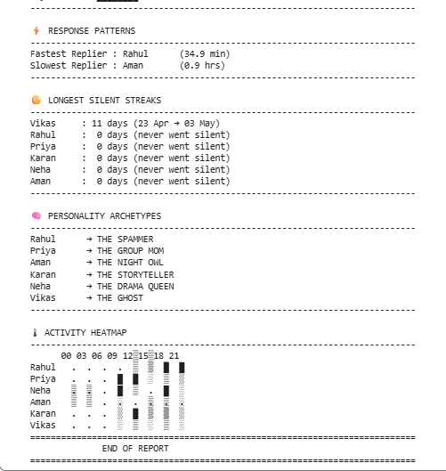
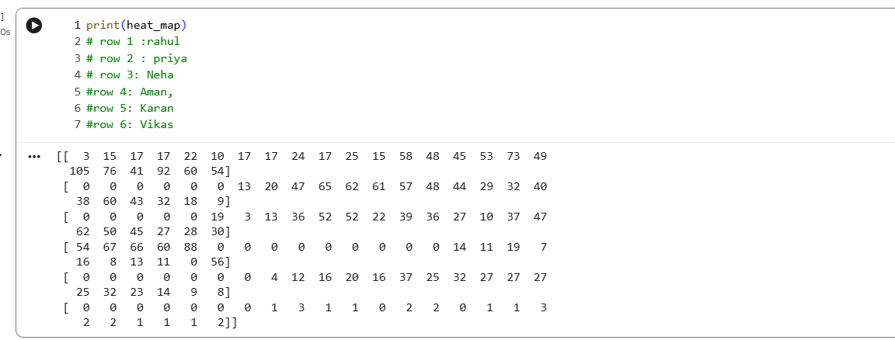
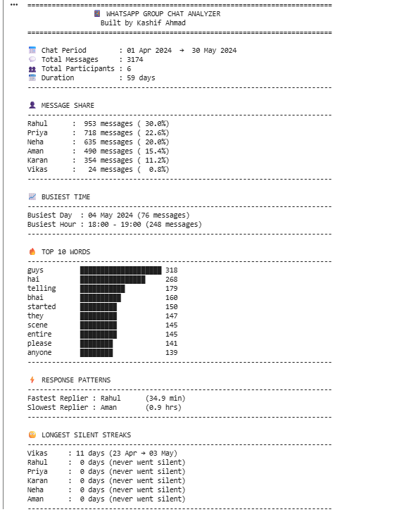

# 📱 WhatsApp Group Chat Analyzer

A Python-based WhatsApp Group Chat Analyzer that extracts meaningful insights from exported WhatsApp chats without using Pandas or visualization libraries.

---

## 🚀 Features

- 📊 Total Messages Analysis
- 👥 Participant-wise Message Share
- 📅 Chat Duration
- 📈 Busiest Day & Busiest Hour
- 🔥 Top 10 Most Used Words
- ⚡ Response Speed Analysis
- 😶 Longest Silent Streaks
- 🧠 Personality Archetypes
- 🌡 Activity Heatmap using NumPy

---

## 🛠 Technologies Used

- Python
- NumPy
- Datetime
- File Handling
- Dictionaries
- Lists
- Functions

---

## 📸 Project Screenshots

### Final Report

---

### Activity Heatmap

---

### Report (Part 2)

---

## 📂 Project Files

- `GroupDNA.ipynb` — Main project notebook
- `hostel_bois.txt` — WhatsApp chat dataset
- `README.md` — Project documentation

---

## ▶️ How to Run

1. Download the repository.
2. Open `GroupDNA.ipynb` in Jupyter Notebook or Google Colab.
3. Keep `hostel_bois.txt` in the same folder.
4. Run all notebook cells.

---

## 👨‍💻 Author

**Kashif Ahmad**

---

⭐ If you like this project, consider giving it a star!
